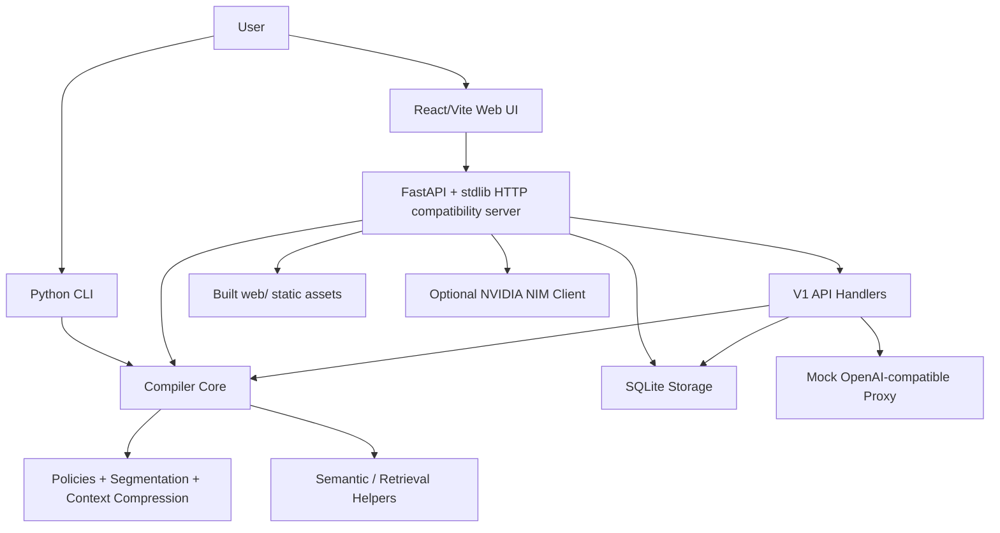

# Project Overview

## What This Project Does

PromptCompiler is a local-first prompt analysis and deterministic prompt compilation workbench. It helps users analyze long prompts, apply compression policies, compare token savings, inspect trust/clarity metadata, and run the same workflows through a web UI, Python API, CLI, and SDK-style helpers.

The project is oriented around prompt optimization rather than free-form LLM rewriting. Current behavior is mostly deterministic and policy driven, with optional NVIDIA NIM integration for prompt generation and summarization when an API key is configured.

## Current Functionality

- Web workbench for prompt input, optimization output, analytics, history, policy controls, and export.
- Deterministic prompt compilation with token accounting and semantic/clarity metadata.
- V1 API surface for analyze, compile, retrieve, lint, request traces, session context, and mock OpenAI-compatible proxy behavior.
- Legacy API surface for earlier `/api/*` analyze, compile, export, NIM summarize, and generated-prompt flows.
- CLI entry points for local operation and server startup.
- SQLite-backed storage for request traces, metrics, sessions, turns, embeddings/fingerprints, and compile cache.
- Static web serving through the Python server after `npm run build`.
- Optional `.env` loading from the repository root unless `PROMPTCOMPILER_DISABLE_DOTENV=1` is set.

## Architecture Diagram

## Tech Stack

- Backend: Python 3, FastAPI, Pydantic Settings, Uvicorn, standard library HTTP server compatibility.
- Frontend: React 19, Vite, Framer Motion, Lucide icons.
- Storage: SQLite by default through local `.promptcompiler/promptcompiler.sqlite3`.
- Tests: Python `unittest`, Node `node --test`, Playwright-like local browser runner script.
- Build: Vite builds frontend into `web/`; Python server serves `web/` and API routes.

## API Structure

- Health and metadata: `/api/health`, `/api/models`, `/api/samples`.
- Legacy API: `/api/analyze`, `/api/compile`, `/api/export`, `/api/nim/summarize`, `/api/generate-prompt`.
- V1 API: `/v1/analyze`, `/v1/compile`, `/v1/retrieve`, `/v1/lint`, `/v1/metrics`, `/v1/requests/{trace_id}`, `/v1/sessions/{session_id}/append`, `/v1/sessions/{session_id}/context`.
- Proxy API: `/v1/proxy/openai/chat/completions`, currently mock-only unless future provider integration is added.

## Database Structure

The project uses SQLite by default. Key persisted areas include:

- Request traces and metrics for observability.
- Session records and session turns for context compression.
- Compile cache entries for repeat compile operations.
- Fingerprint/embedding cache entries for semantic retrieval helpers.

The storage layer uses parameterized SQL in the reviewed code paths, which reduces injection risk. The main concern is privacy scope: raw prompt/session/cache content can still be persisted locally unless zero-retention modes and history behavior are enforced consistently.

## Authentication Flow

There is no first-party authentication flow. The project behaves as a local-first tool with unauthenticated local APIs. NVIDIA NIM authentication is supplied through environment variables such as `NVIDIA_API_KEY`.

If the service is exposed beyond localhost, the lack of auth, rate limiting, and tenant isolation becomes a significant security concern.

## Environment Variables

Known or inferred variables:

- `NVIDIA_API_KEY`: optional provider key for NIM calls.
- `NVIDIA_NIM_BASE_URL`: optional NIM base URL override.
- `PROMPTCOMPILER_DEFAULT_MODEL`: default model identifier.
- `PROMPTCOMPILER_DB_PATH`: SQLite database path.
- `PROMPTCOMPILER_DISABLE_DOTENV`: disables repo-root `.env` loading when set.
- `PROMPTCOMPILER_SESSION_TRIGGER_THRESHOLD`: session summarization trigger threshold.
- `PROMPTCOMPILER_SESSION_SUMMARY_RATIO`: session summary budget ratio.
- Additional `PROMPTCOMPILER_*` settings are modeled through `promptcompiler/settings.py`.

## Deployment Process

No production deployment pipeline was found. The practical local deployment flow is:

1. Install Python requirements.
2. Install frontend dependencies with `npm ci`.
3. Build frontend with `npm run build`.
4. Run the Python server, commonly through `python3 -m promptcompiler.server` or CLI entry points.

`config/hypercorn.toml` binds to `0.0.0.0:9810`, but the project does not currently present a complete production deployment story with auth, TLS, CI, secrets management, or hosted environment configuration.

## Key Modules

- `promptcompiler/compiler.py`: core prompt compilation logic and token accounting.
- `promptcompiler/policies.py`: policy configuration and optimization rules.
- `promptcompiler/v1.py`: v1 API orchestration and response shaping.
- `promptcompiler/fastapi_server.py`: FastAPI routes, legacy handlers, static serving, and compatibility handler.
- `promptcompiler/storage.py`: SQLite persistence for metrics, traces, sessions, and cache.
- `promptcompiler/context_compression.py`: context compression and semantic reduction helpers.
- `promptcompiler/nim.py`: optional NVIDIA NIM integration.
- `src/workbench/*`: primary interactive web workbench.
- `src/services/*`: API, payload, reporting, and history helpers.
- `tests/*`: Python, frontend, and browser verification coverage.

## Risks And Concerns

- A tracked local secret file and tracked log file existed before this audit; both were removed from the current tree and added to `.gitignore`, but historical Git exposure still requires rotation and history cleanup if this repository has been shared.
- The API has no authentication or rate limiting, so the server should stay local-only unless a security boundary is added.
- Browser localStorage history stores prompt/output data, which can conflict with privacy and zero-retention expectations.
- Vite production builds emit source maps, exposing source structure in shipped static assets.
- `react-router-dom` appears unused according to dependency analysis.
- There is no real lint/typecheck framework yet; only a basic whitespace lint script was added during this audit.
- The frontend build can race Python static fallback tests if both run concurrently against `web/`.
