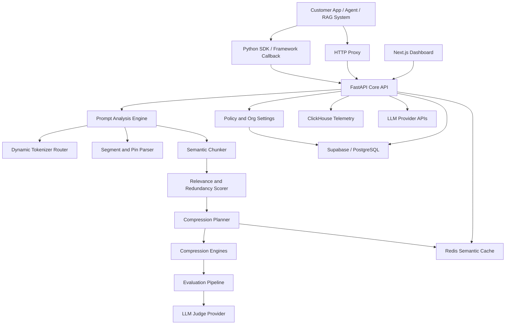
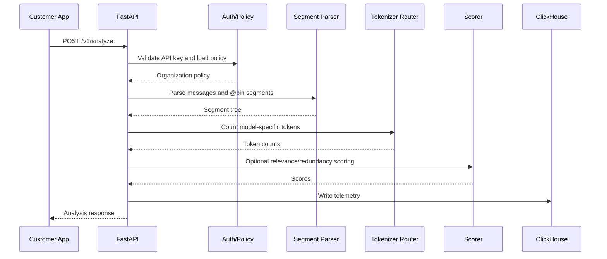
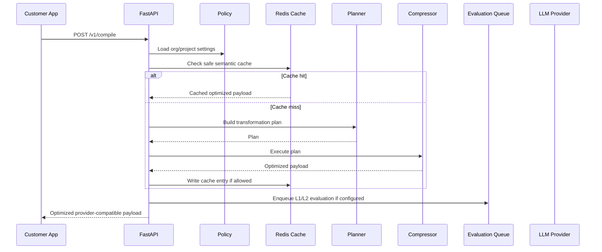

# PromptCompiler Technical Requirements Document

Version: 0.1
Source Documents: PromptCompiler PRD and original project specification PDF
Date: 2026
Status: Draft TRD
Owner: Engineering

## 1. Purpose

This Technical Requirements Document defines the system design, implementation requirements, service boundaries, data models, APIs, algorithms, infrastructure, security requirements, and verification strategy for PromptCompiler.

PromptCompiler is a developer infrastructure platform for LLM context optimization and observability. It sits between AI applications and model providers, analyzes prompt/context payloads, identifies waste, safely compresses or rewrites context, preserves critical information, and measures whether optimization maintains output quality.

This TRD translates the product requirements into an engineering blueprint.

## 2. Scope

### 2.1 In Scope

The technical scope includes:

- Prompt analysis API.
- Prompt compile/optimization API.
- Session-level context management.
- Query-aware RAG chunk optimization.
- Pinned segment parsing and enforcement.
- Dynamic provider-specific tokenizer routing.
- Lossless, balanced, and aggressive compression modes.
- Semantic chunking.
- Redundancy and relevance scoring.
- Semantic cache with correctness guards.
- Layer 1 semantic retention checks.
- Layer 2 sampled output-quality evaluation.
- Zero-retention processing mode.
- Dashboard frontend.
- SDK and HTTP proxy integrations.
- Telemetry, metrics, RBAC, quotas, and organization settings.

### 2.2 Out of Scope for Initial Build

The following are not required for the first implementation, but the architecture must leave space for them:

- Fine-tuned compression models.
- Customer-hosted judge models.
- Full enterprise SSO.
- Full billing automation.
- Multi-region active-active deployment.
- On-prem deployment packaging.
- Provider marketplace.
- Custom visual no-code pipeline builder.

## 3. System Goals

The system must:

- Accurately count model-specific tokens.
- Attribute prompt tokens to structural components.
- Identify redundant and low-relevance context.
- Compress context according to risk mode and target budget.
- Preserve critical context exactly when marked as pinned.
- Avoid spending more on optimization than it saves.
- Make every transformation observable and explainable.
- Provide safe defaults for production use.
- Support zero-retention environments.
- Verify quality using semantic and output-level evaluation.

## 4. Target Architecture

PromptCompiler should use a modular service architecture with a Python backend, a Next.js frontend, Redis for low-latency cache/state, PostgreSQL/Supabase for relational state, and ClickHouse for high-volume telemetry.



## 5. Major Services and Modules

### 5.1 Frontend Dashboard

Technology:

- Next.js App Router.
- TypeScript.
- Tailwind CSS.
- Monaco Editor.
- Recharts.
- Custom SVG or canvas text heatmap overlay.
- Framer Motion for transitions and progress states.

Responsibilities:

- Display request and session token breakdowns.
- Display original vs optimized prompt diffs.
- Display prompt heatmaps.
- Display cost estimates and savings.
- Display cache metrics.
- Display evaluation metrics.
- Display organization settings.
- Display integration instructions.
- Provide prompt inspection and dry-run workflows.

Core frontend routes:

- `/overview`
- `/requests`
- `/requests/[traceId]`
- `/sessions`
- `/sessions/[sessionId]`
- `/rag`
- `/evaluations`
- `/cache`
- `/settings`
- `/integrations`

### 5.2 Core API Service

Technology:

- Python 3.11 or later.
- FastAPI.
- Pydantic v2.
- Async SQLAlchemy or Supabase client for relational state.
- ClickHouse client for telemetry writes and analytics reads.
- Redis client for cache, session locks, and lightweight state.

Responsibilities:

- Expose public API endpoints.
- Authenticate API requests.
- Load organization/project policy.
- Orchestrate prompt analysis.
- Orchestrate prompt optimization.
- Enforce pinned segment and token budget policies.
- Route tokenizer selection.
- Route compression mode.
- Write telemetry.
- Enqueue async evaluation jobs.
- Return provider-compatible payloads where required.

### 5.3 Background Worker Service

Technology:

- Python worker process.
- Celery, RQ, or Dramatiq. Recommended initial choice: Celery with Redis broker because Redis is already required.

Responsibilities:

- Run Layer 2 A/B evaluation.
- Run longer summarization jobs if async mode is enabled.
- Compute aggregate heatmap metrics.
- Periodically expire cache entries.
- Recompute organization analytics.
- Run benchmark suites.

### 5.4 Dynamic Tokenizer Router

Responsibilities:

- Select token counting method based on provider and model.
- Provide a common interface for all tokenizer implementations.
- Return token count, estimated input cost, estimated output cost where pricing is configured.
- Apply conservative fallback estimates if exact tokenizer is unavailable.

Required providers:

- OpenAI through tiktoken.
- Anthropic through Anthropic-compatible tokenizer or SDK token counting.
- Gemini through a provider adapter.

Interface:

```python
class TokenizerAdapter(Protocol):
    provider: str

    def supports(self, model: str) -> bool:
        ...

    def count_text(self, text: str, model: str) -> int:
        ...

    def count_messages(self, messages: list[dict], model: str) -> int:
        ...
```

### 5.5 Prompt Segment Parser

Responsibilities:

- Parse raw model messages into structural components.
- Detect `@pin` annotations.
- Normalize input into an internal segment tree.
- Preserve enough metadata to reconstruct provider-compatible request payloads.

Segment types:

- `system`
- `developer`
- `user`
- `assistant`
- `tool_call`
- `tool_result`
- `rag_chunk`
- `memory_short_term`
- `memory_long_term`
- `schema`
- `function_definition`
- `metadata`

Internal segment object:

```json
{
  "segment_id": "seg_123",
  "trace_id": "tr_123",
  "type": "rag_chunk",
  "role": "user",
  "text": "raw or normalized text",
  "source_id": "doc_456",
  "turn_index": 12,
  "is_pinned": false,
  "token_count": 420,
  "entity_fingerprint": {
    "dates": [],
    "ids": [],
    "proper_nouns": []
  },
  "metadata": {}
}
```

### 5.6 Semantic Chunker

Responsibilities:

- Convert long segments into smaller semantic chunks.
- Preserve sentence boundaries.
- Preserve source metadata.
- Avoid splitting pinned segments unless required for counting or visualization.

Requirements:

- Sliding window size: 256 tokens.
- Overlap: 32 tokens.
- Sentence boundary alignment: spaCy sentence segmenter.
- If sentence alignment exceeds budget significantly, allow fallback split with a warning.

### 5.7 Relevance and Redundancy Scorer

Responsibilities:

- Score each chunk against the current query.
- Score each chunk against other chunks.
- Distinguish similarity from useful relevance.
- Feed decisions into the Compression Planner.

Embedding models:

- Fast path: `sentence-transformers/all-MiniLM-L6-v2`.
- Quality fallback: BGE-family embedding model.

Scores:

- `query_relevance_score`: 0.0 to 1.0.
- `inter_chunk_similarity_score`: 0.0 to 1.0.
- `novelty_score`: 0.0 to 1.0.
- `compression_risk_score`: 0.0 to 1.0.

### 5.8 Compression Planner

Responsibilities:

- Decide whether optimization should occur.
- Select compression mode.
- Enforce cost-benefit heuristic.
- Protect pinned segments.
- Select transformations.
- Produce a transformation plan before mutating context.

Planner input:

- Segments.
- Chunks.
- Token counts.
- Model pricing.
- Compression mode.
- Target token budget.
- Organization policy.
- Query relevance scores.
- Redundancy scores.
- Cache status.

Planner output:

```json
{
  "plan_id": "plan_123",
  "mode": "balanced",
  "target_token_budget": 8000,
  "estimated_original_tokens": 18400,
  "estimated_optimized_tokens": 5200,
  "estimated_savings_usd": 0.11,
  "risk_level": "medium",
  "actions": [
    {
      "action": "dedupe",
      "segment_ids": ["seg_1", "seg_8"],
      "reason": "near duplicate tool output"
    },
    {
      "action": "summarize",
      "segment_ids": ["seg_20", "seg_21"],
      "reason": "old low-relevance history"
    }
  ]
}
```

### 5.9 Compression Engines

The backend must support multiple compression strategies through a shared interface.

Interface:

```python
class Compressor(Protocol):
    mode: str

    async def compress(self, context: CompileContext, plan: CompressionPlan) -> CompileResult:
        ...
```

Required engines:

- Lossless dedupe engine.
- Balanced summarization engine.
- Aggressive budget-fitting engine.
- Tool-output compaction engine.
- RAG chunk pruning engine.
- Session history compaction engine.

### 5.10 Semantic Cache

Technology:

- Redis.

Responsibilities:

- Cache optimized payloads or transformation plans.
- Avoid repeated embedding/scoring/compression work.
- Prevent incorrect cache hits through strict checks.

Cache hit requirements:

- Cosine similarity must be >= 0.97.
- Entity fingerprints must match exactly for:
  - Dates.
  - IDs.
  - Proper nouns.
  - Currency amounts where detected.
  - Numeric thresholds where detected.
- Provider and model must match unless explicitly marked compatible.
- Compression mode must match.
- Organization policy version must match.

Cache miss conditions:

- Similarity below threshold.
- Entity mismatch.
- Different pinned segment fingerprint.
- Different provider/model.
- Zero-retention mode where raw or optimized payload caching is not allowed.
- Risky near-hit.

### 5.11 Evaluation Pipeline

Layer 1:

- Fast semantic similarity check.
- Compare original and optimized prompt embeddings.
- Target: >= 95 percent retention.

Layer 2:

- Sampled A/B output quality evaluation.
- Default traffic sample: 5 percent.
- Configurable range: 1 to 20 percent per organization.
- Run original and optimized prompt through target model, or compare original-response and optimized-response where available.
- Judge responses using an LLM-as-judge G-Eval style rubric.

Layer 2 scoring dimensions:

- Factual consistency.
- Instruction adherence.
- Task completion.

Target:

- Composite score >= 4.0 / 5.0.

Privacy constraint:

- Disable Layer 2 in zero-retention mode unless the organization explicitly allows external judge calls and raw prompt handling.

## 6. Request Lifecycle

### 6.1 Analyze Request Flow



### 6.2 Compile Request Flow



### 6.3 Proxy Request Flow

Proxy mode should preserve provider-compatible request and response shapes.

Flow:

1. Customer changes provider `base_url` to PromptCompiler proxy URL.
2. PromptCompiler receives provider-compatible request.
3. PromptCompiler identifies provider and model.
4. PromptCompiler applies configured analysis or compile policy.
5. PromptCompiler forwards optimized request to provider.
6. PromptCompiler returns provider response to customer application.
7. Telemetry is written asynchronously where possible.

## 7. API Requirements

### 7.1 Authentication

Public APIs must require API key authentication.

Headers:

```http
Authorization: Bearer pc_live_xxx
X-PromptCompiler-Project: proj_xxx
```

Requirements:

- API keys belong to organizations and projects.
- API keys must be hashed at rest.
- API key scopes should support analyze-only, compile, proxy, admin, and read-metrics.
- API responses must not reveal secrets.

### 7.2 POST /v1/analyze

Purpose:

- Analyze token usage, structure, cost, redundancy, pinned content, and compression opportunity.

Request:

```json
{
  "provider": "openai",
  "model": "gpt-4o-mini",
  "messages": [
    {
      "role": "system",
      "content": "@pin You must answer using the required JSON schema."
    },
    {
      "role": "user",
      "content": "Where is my shipment?"
    }
  ],
  "rag_chunks": [],
  "tools": [],
  "session_id": "sess_123",
  "target_token_budget": 8000,
  "mode": "balanced",
  "dry_run": true
}
```

Response:

```json
{
  "trace_id": "tr_123",
  "provider": "openai",
  "model": "gpt-4o-mini",
  "total_tokens": 1200,
  "estimated_input_cost_usd": 0.0018,
  "budget_utilization": 0.15,
  "pinned_tokens": 82,
  "pinned_budget_ratio": 0.01025,
  "components": [
    {
      "component_type": "system",
      "token_count": 82,
      "cost_estimate_usd": 0.00012,
      "is_pinned": true,
      "compression_risk_score": 1.0
    }
  ],
  "recommendation": {
    "should_compile": false,
    "reason": "below budget threshold"
  }
}
```

### 7.3 POST /v1/compile

Purpose:

- Return optimized messages or prompt payload according to configured policy.

Request:

```json
{
  "provider": "openai",
  "model": "gpt-4o-mini",
  "messages": [],
  "rag_chunks": [],
  "tools": [],
  "mode": "aggressive",
  "target_token_budget": 6000,
  "dry_run": false,
  "session_id": "sess_123"
}
```

Response:

```json
{
  "trace_id": "tr_456",
  "mode": "aggressive",
  "original_token_count": 18400,
  "optimized_token_count": 2900,
  "token_reduction_percent": 84.2,
  "estimated_cost_before_usd": 0.0276,
  "estimated_cost_after_usd": 0.0077,
  "estimated_cost_reduction_percent": 72.1,
  "optimized_messages": [],
  "transformations": [
    {
      "type": "dedupe",
      "affected_segment_ids": ["seg_7", "seg_9"],
      "reason": "duplicate tool result"
    }
  ],
  "evaluation": {
    "layer1_retention_score": 0.96,
    "layer2_status": "queued"
  },
  "cache": {
    "status": "miss"
  }
}
```

### 7.4 POST /v1/sessions/{session_id}/append

Purpose:

- Append new context to a managed session and trigger adaptive management if needed.

Request:

```json
{
  "provider": "openai",
  "model": "gpt-4o-mini",
  "turn": {
    "role": "tool",
    "content": "{\"status\":\"failed\",\"logs\":\"...\"}"
  },
  "target_token_budget": 12000,
  "mode": "balanced"
}
```

Response:

```json
{
  "session_id": "sess_123",
  "total_session_tokens": 9100,
  "budget_utilization": 0.758,
  "adaptive_management_triggered": true,
  "summary_segment_id": "seg_summary_1",
  "new_total_session_tokens": 5200
}
```

### 7.5 GET /v1/requests/{trace_id}

Purpose:

- Retrieve request analysis, transformation plan, and metrics.

Response must include:

- Original token count.
- Optimized token count.
- Component breakdown.
- Transformations.
- Heatmap data if available.
- Evaluation scores if available.
- Retention behavior based on organization policy.

### 7.6 GET /v1/metrics

Purpose:

- Return aggregate metrics for dashboards.

Filters:

- `project_id`
- `provider`
- `model`
- `from`
- `to`
- `mode`
- `session_id`

Metrics:

- Requests.
- Original tokens.
- Optimized tokens.
- Token reduction.
- Cost reduction.
- Latency.
- Cache hit rate.
- Evaluation score.
- Error count.

### 7.7 PATCH /v1/org/settings

Purpose:

- Update organization policy.

Mutable fields:

- Default compression mode.
- Pinned token cap.
- Zero-retention enabled.
- Layer 2 sample rate.
- Default target token budget.
- Allowed providers.
- Cache enabled.
- Semantic cache TTL.
- Evaluation enabled.

## 8. Error Handling

### 8.1 Error Format

All API errors should use a consistent format:

```json
{
  "error": {
    "type": "pinned_budget_exceeded",
    "message": "Pinned content exceeds configured token budget.",
    "trace_id": "tr_123",
    "details": {
      "pinned_tokens": 2400,
      "target_token_budget": 8000,
      "allowed_pinned_tokens": 2000
    }
  }
}
```

### 8.2 Required Error Types

- `invalid_api_key`
- `insufficient_scope`
- `unsupported_provider`
- `unsupported_model`
- `tokenizer_unavailable`
- `pinned_budget_exceeded`
- `target_budget_too_small`
- `payload_too_large`
- `compression_failed`
- `provider_request_failed`
- `zero_retention_conflict`
- `evaluation_disabled`
- `rate_limited`

### 8.3 HTTP Status Mapping

- 400: invalid request.
- 401: missing or invalid authentication.
- 403: insufficient scope or policy violation.
- 404: trace/session/project not found.
- 409: zero-retention or policy conflict.
- 413: payload too large or pinned budget exceeded.
- 429: rate limit exceeded.
- 500: internal service error.
- 502: upstream provider error.
- 503: dependency unavailable.

## 9. Core Algorithms

### 9.1 Compile Pipeline

Pseudocode:

```python
async def compile_request(request, org_policy):
    trace = create_trace(request)

    segments = parse_segments(request.messages, request.rag_chunks, request.tools)
    detect_pins(segments)

    token_counts = tokenizer_router.count(request.provider, request.model, segments)
    enforce_pinned_budget(segments, token_counts, org_policy)

    if request.dry_run:
        return analyze_only_response(trace, segments, token_counts)

    cache_result = semantic_cache.safe_lookup(request, segments, org_policy)
    if cache_result.hit:
        write_telemetry(trace, cache_result)
        return cache_result.payload

    chunks = semantic_chunker.chunk(segments)
    scores = scorer.score(chunks, current_query=request.current_query)

    plan = planner.build(
        segments=segments,
        chunks=chunks,
        scores=scores,
        token_counts=token_counts,
        policy=org_policy,
        mode=request.mode,
        target_budget=request.target_token_budget
    )

    result = compressor_registry.execute(plan)
    layer1 = evaluator.layer1_retention(request.original_payload, result.optimized_payload)

    if should_run_layer2(org_policy, request):
        evaluation_queue.enqueue(trace.id, request, result)

    semantic_cache.write_if_allowed(request, result, org_policy)
    write_telemetry(trace, result, layer1)

    return result
```

### 9.2 Pinned Budget Enforcement

Rules:

- Count all pinned tokens using target model tokenizer.
- Compare pinned token count to configured pinned cap.
- Default cap: 25 percent of target token budget.
- If pinned tokens exceed cap, reject request with HTTP 413.
- Pinned segments must never be summarized, deduped, or semantically replaced.

Pseudocode:

```python
def enforce_pinned_budget(segments, token_counts, policy):
    pinned_tokens = sum(token_counts[s.id] for s in segments if s.is_pinned)
    allowed = int(policy.target_token_budget * policy.pinned_token_cap_ratio)

    if pinned_tokens > allowed:
        raise PinnedBudgetExceeded(
            pinned_tokens=pinned_tokens,
            allowed_pinned_tokens=allowed,
            target_token_budget=policy.target_token_budget
        )
```

### 9.3 Cost-Benefit Heuristic

PromptCompiler should not run expensive summarization unless expected savings justify the cost.

Parameters:

- `theta = 0.2`
- `min_savings_multiplier = 1.5`

Logic:

- Estimate compressed output length as input length multiplied by theta.
- Estimate API savings from reduced payload size.
- Estimate summarization cost.
- Run active summarization only if estimated API savings exceed 1.5x summarization cost.
- Otherwise run lossless dedupe only.

Pseudocode:

```python
def should_summarize(input_tokens, pricing, policy):
    estimated_output_tokens = int(input_tokens * 0.2)
    estimated_tokens_saved = input_tokens - estimated_output_tokens
    estimated_api_savings = estimated_tokens_saved * pricing.input_cost_per_token
    estimated_summary_cost = input_tokens * pricing.summary_model_input_cost_per_token

    return estimated_api_savings > (1.5 * estimated_summary_cost)
```

### 9.4 Query-Aware RAG Pruning

Rules:

- Do not remove chunks only because they are similar.
- Remove chunk B only if:
  - B is semantically similar to retained chunk A.
  - B has lower query relevance than A.
  - B does not contain unique entities or citations required by the answer.
  - B is not pinned.

Pseudocode:

```python
def prune_rag_chunks(chunks, similarity_matrix, relevance_scores):
    retained = []
    removed = []

    for chunk in sorted(chunks, key=lambda c: relevance_scores[c.id], reverse=True):
        if chunk.is_pinned:
            retained.append(chunk)
            continue

        redundant_with = find_similar_retained(chunk, retained, similarity_matrix)
        if redundant_with and relevance_scores[chunk.id] < relevance_scores[redundant_with.id]:
            if not has_unique_required_entities(chunk, retained):
                removed.append(chunk)
                continue

        retained.append(chunk)

    return retained, removed
```

### 9.5 Session Adaptive Management

Rules:

- Track total session token count.
- Trigger compression when session exceeds 70 percent of target token budget.
- Preserve current user query and recent intent.
- Preserve pinned content.
- Prefer summarizing old, low-relevance, verbose content.
- Avoid naive FIFO unless no relevance data exists.

Pseudocode:

```python
def maybe_compact_session(session, target_budget):
    if session.total_tokens < int(target_budget * 0.70):
        return session

    turns = score_turns_for_current_query(session.turns)
    candidates = [
        t for t in turns
        if not t.is_pinned and not t.is_recent_critical_intent
    ]

    selected = select_low_relevance_high_token_turns(candidates)
    summary = summarize_turns(selected)
    return replace_turns_with_summary(session, selected, summary)
```

### 9.6 Semantic Cache Safe Lookup

Rules:

- Embed current normalized payload.
- Search Redis/vector index for candidates.
- Candidate must pass:
  - Similarity >= 0.97.
  - Entity fingerprint exact match.
  - Same provider/model.
  - Same compression mode.
  - Same policy version.
  - Same pinned fingerprint.
- Otherwise treat as cache miss.

Pseudocode:

```python
def safe_cache_lookup(payload, policy):
    candidates = cache.search(payload.embedding, min_similarity=0.97)

    for candidate in candidates:
        if candidate.provider != payload.provider:
            continue
        if candidate.model != payload.model:
            continue
        if candidate.mode != payload.mode:
            continue
        if candidate.policy_version != policy.version:
            continue
        if candidate.entity_fingerprint != payload.entity_fingerprint:
            continue
        if candidate.pinned_fingerprint != payload.pinned_fingerprint:
            continue
        return CacheHit(candidate.optimized_payload)

    return CacheMiss()
```

### 9.7 Tool Output Compaction

Rules:

- Parse JSON tool outputs as structured data whenever possible.
- Deduplicate repeated fields and repeated tool responses.
- Preserve:
  - IDs.
  - Dates.
  - Statuses.
  - Amounts.
  - Error codes.
  - File paths.
  - Function names.
  - Current or final result.
- Summarize verbose logs into a compact state narrative.
- Preserve failed logic paths for coding agents.

Fallback:

- If tool output is not valid JSON, treat as text and use entity-aware summarization.

### 9.8 Entity Fingerprinting

Entity fingerprints are used for safety checks, cache correctness, and compression validation.

Required extracted values:

- Dates.
- Times.
- IDs.
- UUIDs.
- Email addresses.
- URLs.
- Proper nouns.
- Currency amounts.
- Percentages.
- File paths.
- Function names.
- Error codes.
- Version numbers.

Implementation:

- Start with regex-based extraction for deterministic entities.
- Use spaCy NER for proper nouns and named entities.
- Normalize entities before comparison.

## 10. Compression Mode Requirements

### 10.1 Lossless Mode

Allowed transformations:

- Exact duplicate removal.
- Near-exact duplicate removal when entity fingerprints match.
- Whitespace normalization only when it does not alter code or schemas.
- Repeated tool-output collapse.

Disallowed transformations:

- Freeform summarization.
- Rewriting system prompts.
- Rewriting pinned segments.
- Reordering semantically meaningful content.

### 10.2 Balanced Mode

Allowed transformations:

- All lossless transformations.
- Summarization of older conversation turns.
- Summarization of verbose tool outputs.
- RAG chunk pruning.
- Session summaries.

Protection rules:

- Preserve current user intent.
- Preserve recent unresolved tasks.
- Preserve pinned content.
- Preserve entities.
- Preserve source/citation IDs.

Target:

- Approximately 60 to 75 percent reduction where possible.

### 10.3 Aggressive Mode

Allowed transformations:

- All balanced transformations.
- Stronger budget-driven selection.
- More aggressive summarization of low-relevance history.
- More aggressive RAG pruning.

Protection rules:

- Pinned content remains exact.
- Current user task remains exact or minimally normalized.
- Tool/function schemas remain valid.
- If target budget cannot be met safely, return partial optimization with warning.

Target:

- Up to approximately 84 percent reduction in benchmarked scenarios.

## 11. Data Storage Design

### 11.1 PostgreSQL / Supabase

Purpose:

- Relational state.
- Users.
- Organizations.
- Projects.
- API keys.
- Settings.
- Billing state.
- RBAC.

#### organizations

Columns:

- `id UUID PRIMARY KEY`
- `name TEXT NOT NULL`
- `plan TEXT NOT NULL`
- `billing_status TEXT NOT NULL`
- `default_compression_mode TEXT NOT NULL`
- `default_target_token_budget INTEGER`
- `pinned_token_cap_ratio NUMERIC DEFAULT 0.25`
- `zero_retention_enabled BOOLEAN DEFAULT FALSE`
- `layer2_eval_enabled BOOLEAN DEFAULT TRUE`
- `layer2_sample_rate NUMERIC DEFAULT 0.05`
- `cache_enabled BOOLEAN DEFAULT TRUE`
- `semantic_cache_ttl_seconds INTEGER`
- `policy_version INTEGER DEFAULT 1`
- `created_at TIMESTAMPTZ`
- `updated_at TIMESTAMPTZ`

#### users

Columns:

- `id UUID PRIMARY KEY`
- `organization_id UUID REFERENCES organizations(id)`
- `email TEXT UNIQUE NOT NULL`
- `role TEXT NOT NULL`
- `auth_provider_id TEXT`
- `created_at TIMESTAMPTZ`
- `updated_at TIMESTAMPTZ`

#### projects

Columns:

- `id UUID PRIMARY KEY`
- `organization_id UUID REFERENCES organizations(id)`
- `name TEXT NOT NULL`
- `default_provider TEXT`
- `default_model TEXT`
- `default_target_token_budget INTEGER`
- `zero_retention_enabled BOOLEAN`
- `created_at TIMESTAMPTZ`
- `updated_at TIMESTAMPTZ`

#### api_keys

Columns:

- `id UUID PRIMARY KEY`
- `organization_id UUID REFERENCES organizations(id)`
- `project_id UUID REFERENCES projects(id)`
- `key_hash TEXT NOT NULL`
- `name TEXT`
- `scopes TEXT[]`
- `last_used_at TIMESTAMPTZ`
- `created_at TIMESTAMPTZ`
- `revoked_at TIMESTAMPTZ`

#### sessions

Columns:

- `id UUID PRIMARY KEY`
- `organization_id UUID REFERENCES organizations(id)`
- `project_id UUID REFERENCES projects(id)`
- `external_session_id TEXT`
- `provider TEXT`
- `model TEXT`
- `target_token_budget INTEGER`
- `current_token_count INTEGER`
- `compression_mode TEXT`
- `created_at TIMESTAMPTZ`
- `updated_at TIMESTAMPTZ`

#### request_traces

Columns:

- `id UUID PRIMARY KEY`
- `organization_id UUID REFERENCES organizations(id)`
- `project_id UUID REFERENCES projects(id)`
- `session_id UUID REFERENCES sessions(id)`
- `provider TEXT`
- `model TEXT`
- `mode TEXT`
- `original_token_count INTEGER`
- `optimized_token_count INTEGER`
- `token_reduction_percent NUMERIC`
- `estimated_cost_before_usd NUMERIC`
- `estimated_cost_after_usd NUMERIC`
- `cache_status TEXT`
- `evaluation_status TEXT`
- `zero_retention BOOLEAN`
- `created_at TIMESTAMPTZ`

Zero-retention:

- In zero-retention mode, this table must not contain raw prompt or response text.

#### evaluation_results

Columns:

- `id UUID PRIMARY KEY`
- `trace_id UUID REFERENCES request_traces(id)`
- `layer INTEGER`
- `retention_score NUMERIC`
- `factual_consistency_score NUMERIC`
- `instruction_adherence_score NUMERIC`
- `task_completion_score NUMERIC`
- `composite_score NUMERIC`
- `judge_model TEXT`
- `status TEXT`
- `created_at TIMESTAMPTZ`

### 11.2 ClickHouse

Purpose:

- High-volume append-only telemetry.
- Fast analytics queries.
- Time-series metrics.

#### request_metrics

Columns:

- `timestamp DateTime64`
- `trace_id String`
- `organization_id String`
- `project_id String`
- `session_id String`
- `provider LowCardinality(String)`
- `model LowCardinality(String)`
- `mode LowCardinality(String)`
- `original_tokens UInt32`
- `optimized_tokens UInt32`
- `tokens_saved UInt32`
- `estimated_cost_before Float64`
- `estimated_cost_after Float64`
- `latency_ms UInt32`
- `compile_latency_ms UInt32`
- `provider_latency_ms UInt32`
- `cache_status LowCardinality(String)`
- `error_type LowCardinality(String)`

Partition:

- Monthly by timestamp.

Order:

- `(organization_id, project_id, timestamp)`

#### component_metrics

Columns:

- `timestamp DateTime64`
- `trace_id String`
- `component_id String`
- `component_type LowCardinality(String)`
- `token_count UInt32`
- `cost_estimate Float64`
- `relevance_score Float32`
- `redundancy_score Float32`
- `risk_score Float32`
- `was_pinned Bool`
- `was_removed Bool`
- `was_summarized Bool`

### 11.3 Redis

Purpose:

- Semantic cache.
- Session locks.
- Rate limiting.
- Celery broker if selected.

Key patterns:

- `pc:cache:{organization_id}:{hash}`
- `pc:lock:session:{session_id}`
- `pc:ratelimit:{api_key_id}:{window}`
- `pc:job:{job_id}`

Semantic cache value:

```json
{
  "provider": "openai",
  "model": "gpt-4o-mini",
  "mode": "balanced",
  "policy_version": 4,
  "embedding_vector_ref": "vec_123",
  "entity_fingerprint": "sha256:...",
  "pinned_fingerprint": "sha256:...",
  "optimized_payload": {},
  "created_at": "2026-05-21T00:00:00Z",
  "expires_at": "2026-05-22T00:00:00Z"
}
```

Zero-retention requirement:

- Do not store `optimized_payload` if zero-retention mode forbids derived text persistence.

## 12. Security Requirements

### 12.1 Authentication and Authorization

- All external APIs require API key auth.
- Dashboard requires user auth through Supabase Auth or equivalent.
- API keys must be hashed at rest.
- API keys must support scopes.
- Organization and project boundaries must be enforced on every query.
- RBAC must restrict settings, billing, and API key management.

### 12.2 Data Protection

- Use TLS for all external and internal network traffic where feasible.
- Encrypt managed databases at rest.
- Never log raw prompts by default.
- Scrub raw payloads from error logs.
- Store provider API keys encrypted.
- Use least-privilege service credentials.

### 12.3 Zero-Retention Mode

When zero-retention mode is enabled:

- Raw prompt text must not be written to PostgreSQL.
- Raw prompt text must not be written to ClickHouse.
- Raw prompt text must not be written to Redis.
- Raw prompt text must not appear in logs.
- Raw prompt text must not be sent to external judge models.
- Semantic cache must be disabled or configured to store no raw or derived text.
- Evaluation must be limited to local metrics unless explicitly allowed.

### 12.4 Audit Requirements

Auditable actions:

- API key created.
- API key revoked.
- Organization settings changed.
- Zero-retention enabled or disabled.
- Evaluation sample rate changed.
- Pinned cap changed.
- Provider credential changed.

Audit event fields:

- Actor ID.
- Organization ID.
- Project ID if applicable.
- Action.
- Old value hash if needed.
- New value hash if needed.
- Timestamp.
- IP address where available.

## 13. Performance Requirements

### 13.1 Latency Targets

Analyze endpoint:

- p50 under 100 ms for prompts under 8,000 tokens without embeddings.
- p95 under 500 ms for prompts under 20,000 tokens with scoring.

Compile endpoint:

- p50 under 250 ms for lossless mode under 8,000 tokens.
- p95 under 1,500 ms for balanced mode without external summarization.
- External summarization latency may exceed these limits and must be reported separately.

Proxy mode:

- Added overhead should be under 300 ms p95 for lossless or cache-hit paths.
- Cache-hit path should be the fastest optimized path.

### 13.2 Throughput Targets

Initial target:

- 100 requests per second per API service instance for analyze-only requests under 8,000 tokens.
- 20 requests per second per API service instance for compile requests requiring embeddings.

### 13.3 Scalability Requirements

- API service must be horizontally scalable.
- Worker service must be horizontally scalable.
- ClickHouse writes should be batched where possible.
- Redis cache should support eviction policies and TTL.
- Long-running evaluations must not block request-response flows.

## 14. Reliability Requirements

### 14.1 Fallback Behavior

If tokenizer unavailable:

- Use conservative token estimate.
- Return warning.
- Do not enforce exact budget decisions unless estimate is safely above threshold.

If embedding model unavailable:

- Fall back to lossless mode.
- Return warning.

If summarization model unavailable:

- Fall back to lossless mode.
- Return warning.

If Redis unavailable:

- Continue without cache.
- Do not fail core compile unless cache is mandatory by policy.

If ClickHouse unavailable:

- Buffer metrics if possible.
- Continue request path.
- Emit operational alert.

If provider request fails in proxy mode:

- Return provider-compatible error where possible.
- Record upstream failure type.

### 14.2 Idempotency

Compile requests may support an optional idempotency key:

```http
Idempotency-Key: user-generated-key
```

Requirements:

- Prevent duplicate async evaluation jobs.
- Return consistent trace ID for repeated requests where applicable.

### 14.3 Session Locking

Session append/compact operations must use a Redis lock:

- Key: `pc:lock:session:{session_id}`
- TTL: short, default 30 seconds.
- Prevent concurrent session compaction from corrupting state.

## 15. Observability Requirements

### 15.1 Logs

Logs must include:

- Trace ID.
- Organization ID.
- Project ID.
- Endpoint.
- Provider.
- Model.
- Mode.
- Error type.
- Latency.

Logs must not include:

- Raw prompt text.
- Raw response text.
- Provider secrets.
- API keys.

### 15.2 Metrics

Operational metrics:

- Request count.
- Error count.
- Latency p50/p95/p99.
- Cache hit rate.
- Cache miss rate.
- Compression mode usage.
- Worker queue depth.
- Evaluation job duration.
- Provider error rate.
- Tokenizer error rate.

Product metrics:

- Original tokens.
- Optimized tokens.
- Tokens saved.
- Cost before.
- Cost after.
- Cost saved.
- Layer 1 retention.
- Layer 2 quality score.
- Pinned budget rejections.
- Session compactions.

### 15.3 Tracing

Use OpenTelemetry where feasible.

Trace spans:

- Authentication.
- Policy load.
- Parsing.
- Token counting.
- Chunking.
- Embedding.
- Scoring.
- Planning.
- Compression.
- Cache lookup.
- Cache write.
- Evaluation enqueue.
- Provider forwarding.
- Telemetry write.

## 16. Frontend Technical Requirements

### 16.1 Prompt Inspector

Requirements:

- Render prompt text in Monaco Editor.
- Highlight `@pin` annotations.
- Show inline token counts where available.
- Display component boundaries.
- Display heatmap overlays.
- Support read-only trace view.
- Support editable dry-run sandbox.

### 16.2 Diff Viewer

Requirements:

- Side-by-side original and optimized prompt.
- Highlight removed, summarized, and preserved sections.
- Show transformation reason per changed region.
- Mark pinned segments as protected.

### 16.3 Dashboard Data Fetching

Requirements:

- Use typed API client.
- Support pagination for request traces.
- Support time-range filters.
- Avoid loading raw prompt text when zero-retention mode is enabled.
- Show zero-retention placeholders instead of unavailable raw content.

## 17. SDK Requirements

### 17.1 Python SDK

Package name:

- `promptcompiler`

Primary API:

```python
import promptcompiler

client = promptcompiler.wrap(openai_client)
```

Requirements:

- Wrap OpenAI client calls.
- Wrap Anthropic client calls.
- Preserve original client method signatures as much as possible.
- Support analyze-only mode.
- Support compile mode.
- Support session IDs.
- Support `@pin` content.
- Expose trace IDs.
- Allow opt-out per call.

Example:

```python
response = client.chat.completions.create(
    model="gpt-4o-mini",
    messages=messages,
    promptcompiler={
        "mode": "balanced",
        "session_id": "support-ticket-123",
        "target_token_budget": 8000
    }
)
```

### 17.2 HTTP Proxy

Requirements:

- Accept provider-compatible request payloads.
- Identify provider from proxy path or configuration.
- Forward optimized payload to provider.
- Preserve response shape.
- Support streaming responses where provider supports streaming.
- Add trace metadata in headers where safe.

Example headers:

```http
X-PromptCompiler-Trace: tr_123
X-PromptCompiler-Original-Tokens: 18400
X-PromptCompiler-Optimized-Tokens: 2900
```

### 17.3 Framework Integrations

LangChain:

- Callback handler for prompt analysis and compile.
- Trace session chains.
- Capture tool outputs.

LlamaIndex:

- Node postprocessor for RAG chunk pruning.
- Preserve source node metadata.
- Return removed and retained node IDs.

## 18. Provider Integration Requirements

### 18.1 OpenAI

Requirements:

- Support chat/completion-style message payloads used by current OpenAI APIs.
- Use tiktoken where applicable.
- Preserve tool/function schemas.
- Preserve streaming option.
- Support prompt caching metadata where provider supports it, but do not depend on it.

### 18.2 Anthropic

Requirements:

- Support Anthropic messages format.
- Preserve system field.
- Preserve tool use and tool result blocks.
- Use provider-compatible token counting.
- Preserve streaming option.

### 18.3 Gemini

Requirements:

- Support Gemini content/parts structure.
- Preserve tool/function declarations.
- Use Gemini-compatible token counting adapter.

### 18.4 Provider-Agnostic Internal Format

All provider payloads must be converted to an internal canonical representation and then reconstructed.

Canonical object:

```json
{
  "provider": "openai",
  "model": "gpt-4o-mini",
  "messages": [],
  "tools": [],
  "system": null,
  "metadata": {}
}
```

Reconstruction requirements:

- Preserve role order.
- Preserve tool call IDs.
- Preserve function schema validity.
- Preserve multimodal parts by metadata, even if image/audio compression is out of scope.

## 19. Benchmarking Requirements

### 19.1 Synthetic Benchmark Suite

Dataset:

- 500 synthetic multi-turn logs.
- Generated using gpt-4o.
- Baseline model: gpt-4o-mini.
- Conversation lengths: 15 to 60 turns.
- Uniform distribution.

Domains:

- Customer support.
- Legal Q&A.
- Coding assistance.
- General chat.
- RAG-style retrieval.

Metrics:

- Token reduction.
- Cost reduction.
- TTFT reduction.
- Layer 1 retention score.
- Layer 2 quality score.
- RAG nDCG.
- Compression overhead.
- Cache hit contribution.

### 19.2 Regression Benchmark Suite

Requirements:

- Include golden prompts and expected protected facts.
- Include adversarial prompts:
  - "Do X" vs "Do not X".
  - Similar text with different dates.
  - Similar text with different IDs.
  - Similar legal clauses.
  - Similar tool outputs with different statuses.
- Track failures over time.
- Prevent releases that degrade safety thresholds.

## 20. Testing Strategy

### 20.1 Unit Tests

Required areas:

- Tokenizer adapters.
- Segment parsing.
- @pin detection.
- Pinned budget enforcement.
- Entity extraction.
- Chunking.
- Cost-benefit heuristic.
- Cache safety checks.
- RAG pruning decisions.
- Session threshold logic.
- Error mapping.

### 20.2 Integration Tests

Required areas:

- Analyze endpoint end to end.
- Compile endpoint end to end.
- Session append and compaction.
- Redis cache lookup and miss.
- ClickHouse telemetry write.
- PostgreSQL policy loading.
- Zero-retention behavior.
- Provider proxy pass-through.

### 20.3 Contract Tests

Required areas:

- OpenAI request reconstruction.
- Anthropic request reconstruction.
- Gemini request reconstruction.
- SDK wrapper compatibility.
- HTTP proxy response shape.

### 20.4 Quality Tests

Required areas:

- Layer 1 retention score.
- Layer 2 judge scoring.
- Pinned content exact preservation.
- Entity preservation.
- RAG nDCG preservation.
- Structured output validity.

### 20.5 Load Tests

Required scenarios:

- Analyze-only high throughput.
- Compile requests with embeddings.
- Cache-heavy workload.
- Long-session compaction.
- ClickHouse sustained writes.

### 20.6 Privacy Tests

Required checks:

- Raw prompt text not stored in PostgreSQL during zero-retention.
- Raw prompt text not stored in ClickHouse during zero-retention.
- Raw prompt text not stored in Redis during zero-retention.
- Raw prompt text not emitted to logs.
- Layer 2 external evaluation disabled under zero-retention.

## 21. Deployment Architecture

### 21.1 Services

Required deployable services:

- `frontend`: Next.js dashboard.
- `api`: FastAPI core service.
- `worker`: async background worker.
- `redis`: cache, locks, broker.
- `postgres`: relational state through Supabase or managed PostgreSQL.
- `clickhouse`: telemetry and analytics.

Optional services:

- `embedding-service`: if embeddings are separated from API.
- `proxy`: if HTTP proxy is deployed separately from core API.

### 21.2 Environment Variables

Required:

- `DATABASE_URL`
- `REDIS_URL`
- `CLICKHOUSE_URL`
- `CLICKHOUSE_USER`
- `CLICKHOUSE_PASSWORD`
- `SUPABASE_URL`
- `SUPABASE_SERVICE_ROLE_KEY`
- `OPENAI_API_KEY`
- `ANTHROPIC_API_KEY`
- `GEMINI_API_KEY`
- `PROMPTCOMPILER_ENV`
- `PROMPTCOMPILER_ENCRYPTION_KEY`
- `PROMPTCOMPILER_DEFAULT_PINNED_CAP_RATIO`
- `PROMPTCOMPILER_DEFAULT_LAYER2_SAMPLE_RATE`

### 21.3 Configuration Management

Requirements:

- Organization policy stored in PostgreSQL.
- Runtime config loaded from environment.
- Provider credentials encrypted.
- Policy version increments when relevant settings change.
- Cache entries include policy version.

## 22. Migration and Versioning

### 22.1 API Versioning

- Public API must be versioned under `/v1`.
- Breaking changes require `/v2`.
- SDK should pin compatible API version.

### 22.2 Policy Versioning

Policy version increments when:

- Compression defaults change.
- Pinned cap changes.
- Cache safety rules change.
- Evaluation rules change.
- Zero-retention changes.

### 22.3 Database Migrations

Requirements:

- Use Alembic or Supabase migrations.
- All schema changes reviewed.
- Migrations must be reversible where practical.
- Avoid raw prompt storage fields in zero-retention-sensitive tables unless guarded by policy.

## 23. Compliance and Privacy Design Notes

PromptCompiler must assume many customer prompts are sensitive.

Design rules:

- The default engineering posture is minimal retention.
- Raw prompt storage should be opt-in for enterprise contexts.
- Zero-retention mode must be enforced at the service layer, not only the UI layer.
- Debug logs must never include full prompt payloads.
- Evaluation pipelines must respect retention settings.
- Cache design must account for derived text being sensitive.

## 24. Acceptance Criteria

### 24.1 MVP Technical Acceptance

The MVP is technically acceptable when:

- `/v1/analyze` returns accurate token counts for at least OpenAI models.
- Prompt components are identified and shown in dashboard.
- `@pin` segments are detected and counted.
- Pinned budget cap defaults to 25 percent.
- Exceeding pinned budget returns HTTP 413.
- `/v1/compile` supports lossless mode.
- Dry run mode returns transformation plan without changing prompt.
- Request traces are written without raw prompt leakage in zero-retention mode.
- Dashboard shows token breakdown and cost estimate.
- Python SDK can wrap at least one provider client.

### 24.2 Safe Compression Acceptance

Safe compression is acceptable when:

- Lossless mode preserves all pinned content exactly.
- Duplicate tool outputs are removed in benchmark scenarios.
- Layer 1 retention scoring is implemented.
- Entity fingerprints are extracted and compared.
- Cache hits require threshold and entity checks.
- Zero-retention disables unsafe cache/evaluation behavior.

### 24.3 Full Platform Acceptance

The broader platform is acceptable when:

- Balanced and aggressive modes are implemented.
- Session-level adaptive compaction triggers at 70 percent budget utilization.
- RAG query-aware redundancy pruning is implemented.
- Semantic cache uses >= 0.97 similarity threshold and exact entity checks.
- Layer 2 A/B evaluation runs at configurable sample rates.
- ClickHouse dashboards show cost, latency, cache, and quality metrics.
- Organization settings control privacy, pinned caps, and evaluation rates.
- Framework integrations exist for LangChain and LlamaIndex.

## 25. Engineering Risks

### 25.1 Quality Regression

Compression may degrade answer quality.

Controls:

- Conservative defaults.
- Dry run.
- Pinned content.
- Entity preservation.
- Layer 1 and Layer 2 evaluation.

### 25.2 Hidden Latency

Optimization may add more latency than it saves.

Controls:

- Cost-benefit heuristic.
- Cache.
- Async evaluation.
- Mode-specific latency budgets.

### 25.3 Incorrect Token Counting

Provider tokenizer differences may cause budget errors.

Controls:

- Provider-specific adapters.
- Validation tests.
- Conservative fallback estimates.

### 25.4 Cache Incorrectness

Semantic cache can return unsafe results.

Controls:

- High similarity threshold.
- Exact entity checks.
- Provider/model/policy matching.
- Risky near-hit fallback.

### 25.5 Privacy Breach

Raw prompt data may leak through logs, cache, or eval.

Controls:

- Zero-retention enforcement.
- Log scrubbing.
- Cache disablement.
- External eval disablement.
- Privacy tests.

## 26. Implementation Milestones

### Milestone 1: Core Analysis

Deliverables:

- FastAPI project.
- Auth and API keys.
- OpenAI tokenizer adapter.
- Segment parser.
- @pin parser.
- Analyze endpoint.
- PostgreSQL organization/project settings.
- ClickHouse request metrics.
- Basic dashboard token breakdown.

### Milestone 2: Lossless Compile

Deliverables:

- Compile endpoint.
- Lossless duplicate removal.
- Pinned cap enforcement.
- Dry run plan.
- Side-by-side diff.
- Python SDK wrapper prototype.

### Milestone 3: Session Management

Deliverables:

- Session append endpoint.
- Session token tracking.
- 70 percent threshold trigger.
- Tool-output compaction.
- Session summary segments.

### Milestone 4: RAG Optimization

Deliverables:

- RAG chunk input support.
- Semantic chunking.
- Embedding scoring.
- Query-aware redundancy pruning.
- Source/citation preservation.

### Milestone 5: Evaluation and Cache

Deliverables:

- Layer 1 retention.
- Redis semantic cache.
- Entity fingerprinting.
- Cache correctness guards.
- Layer 2 evaluation worker.
- Evaluation dashboard.

### Milestone 6: Enterprise Controls

Deliverables:

- Zero-retention enforcement.
- RBAC.
- Quotas.
- Audit events.
- LangChain callback.
- LlamaIndex postprocessor.
- HTTP proxy streaming support.

## 27. Open Technical Questions

- Which exact Anthropic tokenizer API should be used for reliable preflight counting?
- Which Gemini token counting API should be the initial adapter?
- Should embeddings run inside the API service or a separate embedding service?
- Should semantic cache use Redis only or Redis plus a vector index?
- How should optimized payload caching work under zero-retention?
- Which summarization model should power balanced and aggressive modes?
- Should Layer 2 compare two live model calls or compare optimized output against stored original output?
- How should multimodal prompt parts be represented in internal canonical format?
- What is the first production-safe list of automatically protected entities?
- Should `@pin` syntax be accepted inside raw text, structured metadata, or both?
- What is the strictest acceptable p95 latency for proxy mode?

## 28. Summary

PromptCompiler should be built as a modular, policy-driven LLM context infrastructure system. The technical design must prioritize correctness, transparency, privacy, and measurable savings over aggressive compression for its own sake.

The first engineering milestone should prove trustworthy observability and low-risk compaction. Later milestones can add session memory, RAG optimization, semantic caching, and output-quality evaluation. The architecture defined here keeps those pieces separate enough to build incrementally while preserving the long-term platform vision from the PRD.


### Dynamic Model Registry

The system must maintain a dynamic model registry with provider capability metadata.

Example fields:
```python
{
  "provider": "nim",
  "model": "gpt-oss-20b",
  "context_window": 128000,
  "supports_tools": True,
  "supports_json_mode": False,
  "supports_streaming": True,
  "tokenizer": "fallback"
}
```

The platform must never assume:
- tool calling support exists
- JSON mode exists
- structured outputs are reliable
- exact tokenizers exist


## Recommended Initial Provider Models

| Provider | Model | Purpose |
|---|---|---|
| NVIDIA NIM | gpt-oss-20b | Primary development |
| NVIDIA NIM | llama-3.1-70b-instruct | Higher-quality evaluation |
| OpenAI | gpt-4.1-mini | Validation fallback |


## Open-Weight Model Reliability Requirements

Because open-weight and GPT-OSS-class models are weaker than frontier proprietary models, PromptCompiler must prioritize deterministic transformations.

Requirements:
- Prefer deterministic transformations before generative rewriting.
- Minimize summarization where possible.
- Preserve original structure aggressively.
- Keep lossless mode mostly rule-based.
- Attach rollback metadata for balanced and aggressive transformations.
- Preserve original prompts for verification workflows.
- Include transformation confidence scoring.
