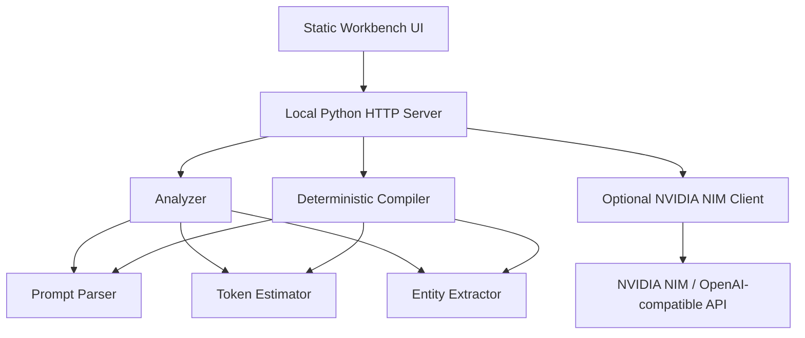

# PromptCompiler TRD

Version: 0.2  
Date: 2026-05-23  
Status: NIM-first local MVP

## 1. Architecture

PromptCompiler MVP is a small local web application with a Python core and a static browser UI.



## 2. Technology Choices

- Runtime: Python 3.11+ using standard library only for the server.
- Tests: Python `unittest`.
- Frontend: Static HTML, CSS, and JavaScript.
- API shape: JSON over local HTTP.
- NIM endpoint: `https://integrate.api.nvidia.com/v1/chat/completions`.
- Secret: `NVIDIA_API_KEY` environment variable.

No database is required for the MVP.

## 3. File Layout

```text
promptcompiler/
  __init__.py
  analyzer.py
  compiler.py
  entities.py
  nim.py
  parser.py
  server.py
  tokenizer.py
web/
  app.js
  index.html
  styles.css
tests/
  test_analyzer.py
  test_compiler.py
  test_entities.py
  test_nim.py
README.md
prd.md
trd.md
```

## 4. Core Data Types

### Segment

```json
{
  "id": "seg_1",
  "type": "system|user|assistant|tool|rag|text",
  "role": "system|user|assistant|tool|unknown",
  "text": "segment text",
  "tokens": 42,
  "pinned": false,
  "entities": ["CASE-123", "2026-05-23"]
}
```

### Analysis Result

```json
{
  "total_tokens": 1000,
  "segment_count": 6,
  "by_type": {"user": 300},
  "by_role": {"user": 300},
  "largest_segments": [],
  "duplicate_groups": [],
  "protected_entities": [],
  "compression_opportunity": 0.4
}
```

### Compile Result

```json
{
  "original_tokens": 1000,
  "optimized_tokens": 740,
  "tokens_saved": 260,
  "savings_ratio": 0.26,
  "optimized_text": "...",
  "changes": []
}
```

## 5. Parser Requirements

The parser accepts:

- Raw text.
- JSON object with `messages`.
- JSON array of messages.

Message parsing rules:

- `role` maps to segment role.
- `content` is coerced to text.
- Tool roles are classified as `tool`.
- Text containing `@pin` is marked pinned.
- Plain text is split into paragraphs and fenced code blocks.

## 6. Token Estimator

The MVP uses a conservative local estimator:

- Count word-like tokens, punctuation runs, and code symbols.
- Add a small per-message overhead for chat segments.
- Keep provider/model fields in the API so a future exact tokenizer can be added.

The estimator must be deterministic and fast.

## 7. Entity Extractor

The extractor identifies protected values:

- URLs.
- ISO-like dates.
- Currency amounts.
- Uppercase IDs such as `CASE-123`.
- UUIDs.
- Numeric thresholds and percentages.

Compile operations must avoid dropping segments that contain unique protected entities unless the segment is an exact duplicate of another retained segment.

## 8. Deterministic Compiler

Pipeline:

1. Parse input into segments.
2. Analyze tokens and entities.
3. Retain all pinned segments exactly.
4. Remove exact duplicate unpinned segments.
5. Compact repeated adjacent lines in tool/log-like segments.
6. Truncate very large unpinned tool/log segments with an explicit omission marker.
7. Rebuild optimized text.
8. Return token savings and change report.

Safety rules:

- Pinned text is never changed.
- Unique protected entities are preserved.
- Every removal is reported.
- The compiler never calls an external API.

## 9. NVIDIA NIM Client

The NIM client:

- Reads `NVIDIA_API_KEY` from the environment.
- Uses OpenAI-compatible request format.
- Sends requests to `https://integrate.api.nvidia.com/v1/chat/completions`.
- Defaults to `openai/gpt-oss-20b`, configurable by request.
- Uses low temperature for compression tasks.
- Returns a structured error if the key is missing.

NIM summarization prompts must instruct the model to:

- Preserve IDs, dates, URLs, currency, percentages, and explicit user constraints.
- Not summarize pinned text.
- Return concise text only.

## 10. Local API

### `GET /api/health`

Returns app status and whether NIM is configured.

### `POST /api/analyze`

Request:

```json
{
  "input": "raw text or JSON",
  "model": "openai/gpt-oss-20b"
}
```

Response: analysis result plus parsed segments.

### `POST /api/compile`

Request:

```json
{
  "input": "raw text or JSON",
  "model": "openai/gpt-oss-20b"
}
```

Response: compile result.

### `POST /api/nim/summarize`

Request:

```json
{
  "text": "unpinned text to summarize",
  "model": "openai/gpt-oss-20b"
}
```

Response:

```json
{
  "summary": "compressed text",
  "model": "openai/gpt-oss-20b"
}
```

## 11. Testing Requirements

Unit tests must cover:

- Raw text parsing.
- OpenAI message parsing.
- Pin detection.
- Token estimation stability.
- Entity extraction.
- Exact duplicate removal.
- Pinned preservation.
- Tool/log line compaction.
- NIM missing-key behavior.
- NIM request payload construction.

## 12. Verification Commands

```bash
python3 -m unittest discover -s tests
python3 -m promptcompiler.server
```

Manual browser verification:

- Open `http://127.0.0.1:8765`.
- Paste a repeated chat payload.
- Run Analyze.
- Run Compile.
- Confirm optimized text and changes render.
- Confirm NIM status changes when `NVIDIA_API_KEY` is set.
